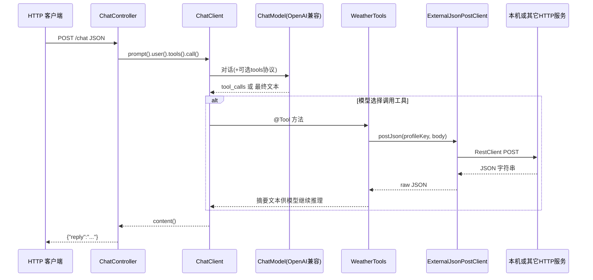

# spring-ai-lab：项目能力与 Spring AI 工程化对照说明

本文档基于当前仓库源码与配置整理，用于理解**项目已具备什么**、**能否用本工程代码覆盖此前讨论的工程化要点**，以及**模块与调用关系**。若与代码不一致，以 `src/main/java` 与 `src/main/resources` 为准。

---

## 一、先回答核心问题：用代码能否「完全 hold 住」？

这里必须拆成两种含义，否则容易误判。

### 1.1 含义 A：「当前已经写好的代码」是否已覆盖全部要点？

**否。**  
当前仓库是**最小可运行实验工程**：同步 `ChatClient`、多 `@Tool`、统一外部 POST、Redis 向量检索、MyBatis-Plus 用户查询、Resilience4j、traceId 等。**未实现**（或仅部分具备）的常见工程化能力包括：流式 SSE、会话记忆（ChatMemory）、Spring AI 侧 RAG Advisor 编排、Embedding 管线、结构化输出到 DTO、面向 LLM 调用的完整可观测指标、JWT 多租户会话隔离等。下文「第八章」有逐项对照表。

### 1.2 含义 B：「以本仓库为基底，用 Java + Spring AI 是否能把那些点都做进同一个项目」？

**可以。**  
本工程已具备 Spring Boot 3、Spring AI（OpenAI 兼容 Chat）、Web、MySQL、Redis、出站 HTTP 抽象与韧性组件，**技术栈上足以渐进式增加**流式接口、记忆存储、文档摄入与向量写入、Advisor、安全与测试等，无需换项目骨架。代价是：依赖增加、配置变复杂、需要按 profile 拆分本地/联调环境。

**结论**：若目标是「一个仓库演示 Spring AI 工程师全套能力」，**可以 hold 住**；若目标是「不改一行代码就已经全部具备」，**不能**。

---

## 二、项目定位与边界

| 维度 | 说明 |
|------|------|
| 工程名 | `spring-ai-lab`（Maven `artifactId` 同） |
| 定位 | JDK 17 + Spring Boot 3 + **Spring AI 1.0.5**，通过 **OpenAI 兼容** 客户端对接 **DashScope（qwen）** 或 **DeepSeek**，演示 **Function Calling**（`@Tool` + `ChatClient`）及与内部 API / Redis 向量的联动 |
| 非目标 | 不是完整生产级对话产品；README 与既有文档已写明「最小示例」「演示数据」等限制 |

**面试表述建议**：对外说明时区分「已落地代码」与「规划可扩展」，避免把规划能力说成已交付。

---

## 三、技术栈与版本（以 `pom.xml` 为准）

| 类别 | 组件与版本 |
|------|------------|
| 语言 | Java 17 |
| 父工程 | Spring Boot **3.4.5** |
| AI | Spring AI BOM **1.0.5**，当前使用 `spring-ai-starter-model-openai` |
| Web | `spring-boot-starter-web` |
| 持久化 | MyBatis-Plus **3.5.7** + MySQL 驱动 |
| Redis | `spring-boot-starter-data-redis`（向量检索走 RediSearch KNN，见领域服务） |
| 稳定性 | Resilience4j **2.4.0**（Retry + CircuitBreaker） |
| 测试 | `spring-boot-starter-test`、`mockwebserver` |

**说明**：当前 `pom.xml` 未引入 Spring AI 的 Embedding / VectorStore 专用 starter；若要做「官方 RAG 抽象 + Advisor」路线，需在依赖与配置上扩展，而不是「开箱已有」。

---

## 四、源码目录结构（主流程）

```
src/main/java/com/springailab/lab/
├── SpringAiLabApplication.java     # 启动类；处理 qwen/deepseek 与双 Key 冲突
├── web/                            # HTTP 层
│   ├── ChatController.java         # POST /chat
│   ├── UserQueryController.java    # /api/users/**
│   ├── VectorSearchController.java # /api/vector/search
│   ├── MockExternalApiController.java # mock profile 下 /mock/**
│   ├── TraceIdFilter.java
│   └── dto/                        # 请求/响应 DTO
├── tools/
│   └── WeatherTools.java           # @Tool 集合（天气、demo、用户、向量）
├── external/                       # 出站 POST JSON 抽象
│   ├── ExternalJsonPostClient.java
│   ├── RestClientExternalJsonPostClient.java
│   ├── ExternalJsonPostConfiguration.java
│   ├── LabExternalPostProperties.java
│   └── ...
├── domain/
│   ├── user/                       # 用户领域：Entity、Mapper、Service
│   └── vector/                     # 向量领域：Redis 检索、配置
```

测试代码位于 `src/test/java/...`，使用 `application-test.yml` 与占位 Key，**不调用真实大模型**（以现有测试类为准）。

---

## 五、Spring Profile 与配置分层

### 5.1 主配置 `application.yml`

- 默认 `spring.profiles.active: qwen`（可按需改为 `deepseek` 或通过环境变量覆盖）。
- `logging.pattern.level` 带 MDC `traceId`。
- `resilience4j`：`externalPost` 实例的 retry / circuitbreaker。
- `lab.external.post.endpoints`：各 Tool 调用的 **base-url + path**；其中 `user-query`、`vector-search` 默认指向本机 `8080`（与 Spring Boot 同进程时需注意端口/启动顺序，属联调设计）。

### 5.2 模型相关

| Profile 文件 | 作用 |
|--------------|------|
| `application-qwen.yml` | DashScope OpenAI 兼容端点、`DASHSCOPE_API_KEY`、模型名（如 `qwen3.5-plus`） |
| `application-deepseek.yml` | DeepSeek 端点、`SPRING_AI_OPENAI_API_KEY`、`deepseek-chat` |

### 5.3 数据与向量

| Profile 文件 | 作用 |
|--------------|------|
| `application-mysql.yml` | 数据源与 MyBatis-Plus；具体 URL/账号建议仅通过环境变量注入生产值 |
| `application-redis-vector.yml` | Redis 连接与 `lab.vector.redis.*`（索引名、向量字段、内容字段、默认 topK、距离度量） |

### 5.4 本地 Mock

| Profile | 作用 |
|---------|------|
| `mock` | 启用 `MockExternalApiController`，提供 `/mock/weather`、`/mock/demo-echo` 等，便于不依赖真实外部服务 |

**典型激活方式**（与注释一致）：  
`SPRING_PROFILES_ACTIVE=qwen,mysql,redis-vector` 或按需追加 `mock`。

---

## 六、启动类中的特殊逻辑（与面试相关）

`SpringAiLabApplication` 除 `@SpringBootApplication`、`@MapperScan` 外，还包含：

1. **`resolveApiKeyConflict()`**  
   当同时存在 `SPRING_AI_OPENAI_API_KEY`（DeepSeek）与 `DASHSCOPE_API_KEY`（通义）时，Spring Boot 可能把错误 Key 绑定到 `spring.ai.openai.api-key`。启动前用 `System.setProperty` 按当前 profile 强制选用正确 Key，避免 DashScope **401**。

2. **`ApplicationReadyEvent` 监听器**  
   在 `qwen` / `deepseek` profile 下若检测到 Key 缺失，向控制台输出明确错误提示。

3. **`maskKey` 打印**  
   仅脱敏展示环境变量 Key 片段，**不要把真实 Key 写入日志文件或提交仓库**。

---

## 七、核心业务链路说明

### 7.1 对话 + 工具调用（主链路）



**关键类**：

- `ChatController`：`ChatClient.builder(chatModel).build()`，`.tools(weatherTools)`，`.call().content()`；捕获 `NonTransientAiException`，对 401 等返回明确 HTTP 状态与提示。
- `WeatherTools`：多个 `@Tool`，内部统一走 `ExternalJsonPostClient`，并对 JSON 做**短摘要**（`truncateForModel`），避免把过长原始 JSON 塞回模型。

### 7.2 工具 → 外部 HTTP 契约

- 接口：`ExternalJsonPostClient#postJson(String profileKey, Object body)`。
- 实现：`RestClientExternalJsonPostClient`，带 `@Retry`、`@CircuitBreaker`（name=`externalPost`），超时在 `ExternalJsonPostConfiguration` 中通过 `SimpleClientHttpRequestFactory` 配置（连接/读超时毫秒级常量）。
- Profile Key 常量：`ExternalPostProfileKeys`（如 `WEATHER`、`USER_QUERY`、`VECTOR_SEARCH` 等）。

### 7.3 项目内 REST API（供 Tool 或人工调用）

| 方法 | 路径 | 说明 |
|------|------|------|
| POST | `/chat` | 对话入口，`ChatRequest{message}` |
| GET | `/api/users/{userId}/username` | 按 ID 查用户名 |
| POST | `/api/users/username-query` | POST 版，Body 含 `userId`（Tool 使用） |
| POST | `/api/vector/search` | Body：`queryVector` 数组、`topK`；返回 `items` |

**领域服务**：

- `UserQueryService`：`userId` 校验、`SysUserMapper` 查询。
- `VectorSearchService`：将 `List<Double>` 转为 float32 字节，通过 `StringRedisTemplate` 执行 RediSearch **FT.SEARCH** KNN，解析返回列表。

### 7.4 Mock 外部服务

- `@Profile("mock")` 的 `MockExternalApiController`：`/mock/weather`、`/mock/demo-echo`，用于本地联调。

### 7.5 可观测与追踪

- `TraceIdFilter`：从请求头读取或生成 `X-Trace-Id`，放入 MDC，响应头回传；出站 `RestClientExternalJsonPostClient` 在存在 traceId 时写入请求头，便于串联日志。

---

## 八、与「Spring AI 工程化常见实操」的对照

下表中的「本仓库」指**当前已实现代码**，不是规划。

| 实操点 | 本仓库现状 | 在本仓库中扩展的可行性与注意点 |
|--------|------------|--------------------------------|
| 1 流式输出（SSE 等） | `ChatController` 为同步 `String` 返回 | 可增加新端点：`ChatClient` 的 `stream()` + `text/event-stream`；注意 Servlet 异步/线程与客户端断开 |
| 2 会话记忆（ChatMemory、多轮） | 无多轮消息栈；每次仅 `user(message)` | 可引入 `Message` 历史 + Redis 存储 + conversationId；与现有 Redis 可复用基础设施 |
| 3 结构化输出（JSON → DTO） | 当前仅 `Map`/`String` 回复 | 可用 Spring AI 的 bean/结构化输出能力（以所用版本文档为准）+ Jakarta Validation |
| 4 Embedding + RAG Advisor | 向量检索为**自研 Redis KNN**；Tool 中 `vectorSearchByCsv` 传手工向量；**无**文档摄入管线、**无** Spring AI `VectorStore`/Advisor 调用链 | 可新增：Embedding API、PDF/Md Reader、Chunking、写入 Redis 或适配 `VectorStore`；编排层用 Advisor 或自建 `检索→拼 prompt` 服务 |
| 5 Advisor / 可观测指标 | 无 Advisor；有 traceId + 日志；Resilience4j 针对**外部 POST** | 可对 LLM 调用加 Micrometer/Advisor；与现有 trace 体系结合 |
| 6 提示词工程化 | 系统提示未单独外置为资源/版本化模块 | 可抽 `system` 文本、模板与配置项 |
| 7 测试 | 部分单元测试（如 External、Tools、Vector）；`verify` 不依赖真实模型 | 可增加 Chat 流集成测试（Mock 模型）、RAG 管道测试 |
| 8 安全与治理 | 无 JWT；Tool 调内部 API 依赖网络可达性；`UserQueryService` 有基础参数校验 | 需增加认证授权、Tool 参数白名单、敏感接口保护、限流与审计 |

---

## 九、依赖与外部服务清单（运行前心里要有数）

| 依赖 | 用途 |
|------|------|
| DashScope 或 DeepSeek API | `/chat` 真正推理与工具决策 |
| MySQL（`mysql` profile） | 用户表查询 |
| Redis + RediSearch（`redis-vector` profile） | 向量索引与 KNN 检索 |
| `lab.external.post` 指向的 HTTP 服务 | 天气/demo 等；默认部分为无效端口，需改配置或启用 `mock` |

---

## 十、与仓库内其它文档的关系

| 文档 | 建议用途 |
|------|----------|
| `README.md` | 快速运行与 curl 示例（部分内容可能与多 profile 演进不完全同步，以 `application.yml` 注释为准） |
| `docs/技术栈说明.md` | 精简导航与面试要点 |
| `docs/本地运行指南_JDK17.md` 等 | 环境与本机脚本 |
| `docs/AI调用链入门指南.md` 等 | 调用链细节 |
| `openspec/changes/**` | 变更提案与任务拆解（若参与 OpenSpec 流程） |

本文档**不替代**上述细文，而是做「全局 + 能力对照」总览。

---

## 十一、学习/扩展路线与本文档的用法

1. **先对照第八章**：明确简历与口述里哪些属于「已有」，哪些属于「设计/进行中」。  
2. **扩展时优先保持边界**：对话入口（`web`）、工具（`tools`）、出站（`external`）、领域（`domain`）分层已清晰，新能力尽量落在独立包或类，避免 `ChatController` 无限膨胀。  
3. **RAG 若接入 Spring AI 抽象**：需同步更新 `pom.xml` 与 profile，并在文档中补充「新增依赖与启动参数」。

---

**文档维护**：随代码变更更新第八章表格与第七章 API 表；版本号以 `pom.xml` 为准。

**作者说明**：本文档为仓库说明性文档；业务代码中的 `@author` 以各 Java 文件为准。
